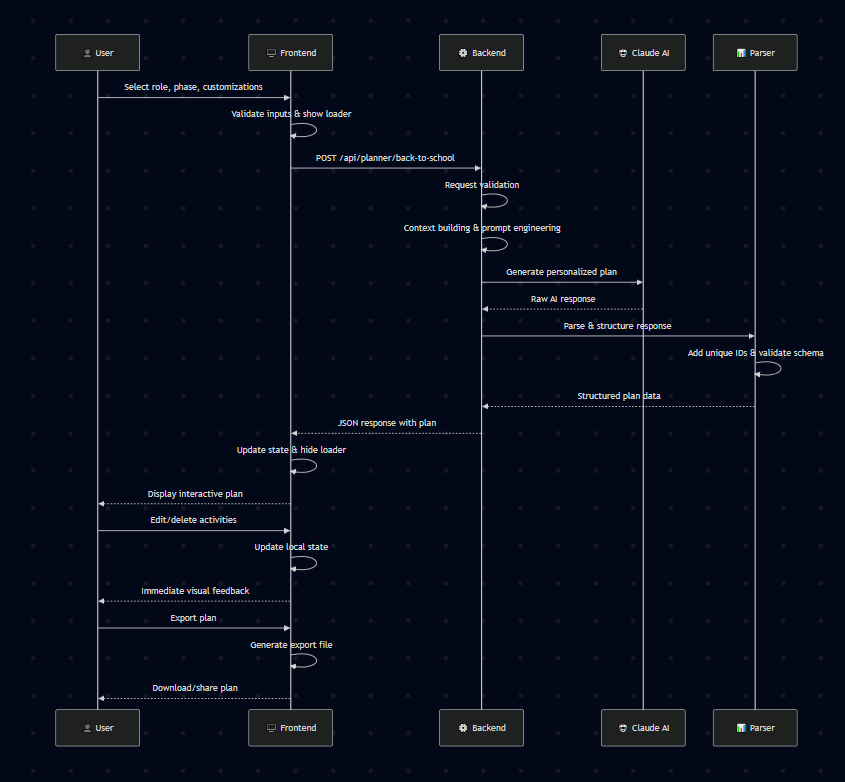
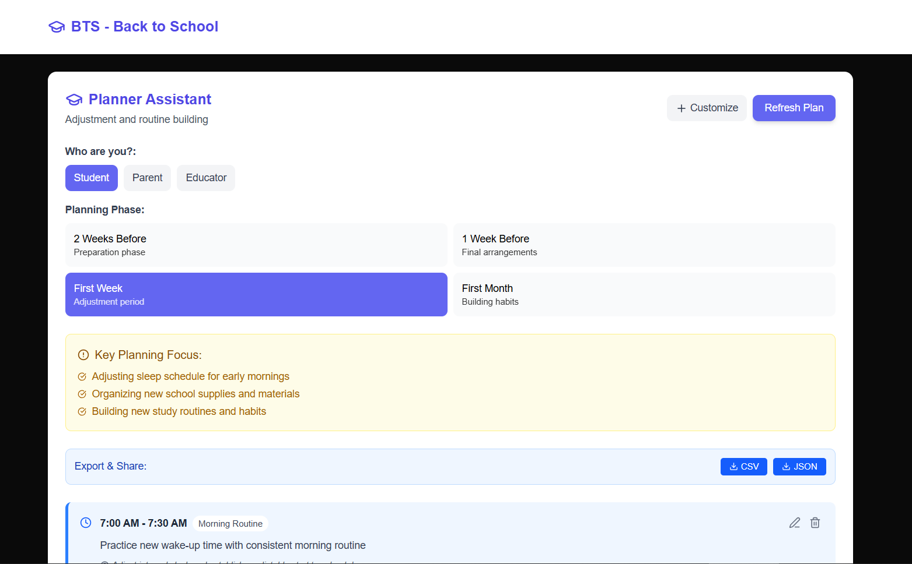

# 🎒 BTS - Back to School

> **Intelligent, personalized back-to-school transition planning for students, parents, and educators**

[](https://nextjs.org/)
[](https://www.typescriptlang.org/)
[](https://tailwindcss.com/)
[](https://www.heroku.com/)
[](https://www.anthropic.com/claude)

BTS Back to School Onboard is an AI-powered planning assistant that creates personalized, phase-based transition schedules to help students, parents, and educators successfully navigate the back-to-school period. From preparation logistics to habit formation, BTS provides actionable, time-sensitive guidance tailored to your unique needs.

---

## 🚀 Quick Start

### Prerequisites
- **Node.js** 18+
- **npm** or **yarn** package manager
- **Heroku Inference API** access token

### Installation

1. **Clone the repository**
   ```bash
   git clone https://github.com/Nicanor008/Heroku-Back-to-School-AI-Challenge.git
   cd Heroku-Back-to-School-AI-Challenge
   ```

2. **Install dependencies**
   ```bash
   # Frontend
   cd frontend
   npm install
   
   # Backend
   cd ../backend  
   npm install
   ```

3. **Environment setup**
   ```bash
   # Backend .env
   INFERENCE_API_URL=heroku_inference_url
   HEROKU_INFERENCE_TOKEN=your_heroku_inference_token
   PORT=5000
   NODE_ENV=development
   
   # Frontend .env.local
   NEXT_PUBLIC_API_URL=http://localhost:5000
   ```

4. **Start development servers**
   ```bash
   # Terminal 1 - Backend
   cd backend
   npm run dev
   
   # Terminal 2 - Frontend  
   cd frontend
   npm run dev
   ```

5. **Open application**
   ```
   http://localhost:3000
   ```

---

## 🌟 Features

### 🎯 **Persona-Based Planning**
- **Student Mode**: Sleep adjustment, study routines, social preparation, organization systems
- **Parent Mode**: Family coordination, emotional support, school communication, logistics management
- **Educator Mode**: Classroom setup, curriculum planning, student relations, professional preparation

### 📅 **Phase-Driven Timeline**
- **2 Weeks Before**: Preparation and logistics focus
- **1 Week Before**: Final arrangements and mental preparation
- **First Week**: Adjustment period and routine establishment
- **First Month**: Habit formation and system optimization

### 🎨 **Smart Customization**
- **Focus Areas**: Choose priority areas like Time Management, Organization, Social Skills
- **Custom Requirements**: Add specific needs, constraints, or preferences
- **Adaptive Planning**: AI adjusts plans based on your selections and phase

### ✏️ **Interactive Management**
- **Live Editing**: Modify activities directly in the interface
- **Smart Deletion**: Remove activities that don't fit your needs
- **Visual Feedback**: See changes instantly with comprehensive notifications

---

### 🔄 **Data Flow Architecture**


---

## 🎯 Usage Guide

### Basic Planning Flow

1. **Choose Your Role**
    - Select Student, Parent, or Educator based on your needs
    - Each role provides specialized planning approaches

2. **Select Planning Phase**
    - **2 Weeks Before**: Focus on preparation and logistics
    - **1 Week Before**: Final arrangements and mental prep
    - **First Week**: Adjustment and routine building
    - **First Month**: Habit formation and optimization

3. **Customize Your Plan**
    - Click "Customize" to add focus areas
    - Add special requirements or constraints
    - View applied customizations before generating

4. **Generate & Review**
    - Click "Refresh Plan" to generate your personalized schedule
    - Review activities with time, category, activity, and purpose
    - See key challenges being addressed

5. **Edit & Optimize**
    - Click edit (pencil) icon to modify activities
    - Click delete (trash) icon to remove unwanted items
    - Changes persist throughout your session

6. **Export & Share**
    - Export as CSV for spreadsheets
    - Export as JSON for data processing
    - Share via device native sharing or clipboard

### Advanced Features

#### Focus Areas by Role
- **Student**: Study Habits, Time Management, Organization, Social Skills, Self-Care
- **Parent**: Family Communication, Logistics, Emotional Support, Academic Support
- **Educator**: Classroom Management, Student Engagement, Curriculum Planning

#### Phase Progression
- Use "Next Phase" button to move through timeline
- Plans automatically adapt to new phase requirements
- "Start Over" option when reaching final phase

#### Interactive Editing
- **Inline editing**: Modify time, category, activity, and purpose directly
- **Real-time validation**: Immediate feedback on changes
- **Persistent changes**: Modifications maintained during session

---

## 🛠️ Technical Stack

### Frontend
- **Framework**: Next.js 14 with App Router
- **Language**: TypeScript for type safety
- **Styling**: Tailwind CSS for responsive design
- **Icons**: Lucide React for consistent iconography
- **State**: Zustand for lightweight state management

### Backend
- **Runtime**: Node.js with Express.js
- **AI Integration**: Heroku Inference API (Claude-4-Sonnet)
- **Parsing**: Custom JSON response processing
- **Logging**: Chalk for console output

---

## Demo

